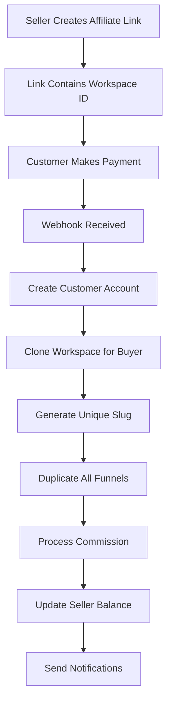

# Affiliate Workspace Marketplace Implementation Guide

## Table of Contents

1. [Overview](#overview)
2. [System Architecture](#system-architecture)
3. [Database Schema Updates](#database-schema-updates)
4. [Implementation Phases](#implementation-phases)
5. [Function Specifications](#function-specifications)
6. [Webhook Handling](#webhook-handling)
7. [Testing Strategy](#testing-strategy)
8. [Progress Tracking](#progress-tracking)

---

## Overview

### Business Requirements

The affiliate marketplace allows users to sell their workspaces to customers through payment links. When a customer purchases:

1. They receive a complete cloned copy of the workspace
2. The seller retains their original workspace unchanged
3. The seller earns commission based on their percentage
4. The cloned workspace has a unique slug (auto-generated)
5. All funnels and pages are duplicated to the new workspace

### Technical Scope

- **YES** workspace cloning (buyer gets independent copy)
- **NO** ownership transfer (seller keeps original)
- **NO** withdrawal system (Phase 1)
- **Focus**: Affiliate, Payment Links, Workspace Cloning, Subscriptions

### Key Workflow



---

## System Architecture

### Current State

- Affiliate links track referrals for plan purchases
- Payments store commission amounts but don't process them
- Workspaces have single ownership model
- No workspace cloning mechanism exists

### Target State

- Affiliate links will include workspace selling capability
- Commission automatically credited to seller balance
- Workspace cloning creates independent copies for buyers
- Complete audit trail of all cloning transactions

### Data Flow

```text
Payment Link Generation:
User -> API -> Validate Workspace -> Generate JWT -> Return Link

Payment Processing:
Customer -> MamoPay -> Webhook -> Our API -> Clone Workspace -> Update Balance

Workspace Cloning:
Original Workspace -> Clone Service -> New Workspace (with unique slug) -> Duplicate Funnels -> Copy Pages

Commission Flow:
Payment Created -> Calculate Commission -> Update Balance -> Log Transaction
```

---

## Database Schema Updates

### Phase 1: Core Schema Changes

#### 1. Update PaymentType Enum

```prisma
enum PaymentType {
  PLAN_PURCHASE
  ADDON_PURCHASE
  ADDON_RENEWAL
  WORKSPACE_PURCHASE  // NEW
}
```

#### 2. Update Payment Model

```prisma
model Payment {
  // ... existing fields ...
  workspaceId           Int?           // NEW: Workspace being purchased
  workspace             Workspace?     @relation(fields: [workspaceId], references: [id])
}
```

#### 3. Add BalanceTransaction Model

```prisma
model BalanceTransaction {
  id              Int                    @id @default(autoincrement())
  userId          Int
  type            BalanceTransactionType
  amount          Float
  balanceBefore   Float
  balanceAfter    Float
  referenceType   String?                // "Payment", "Withdrawal", etc.
  referenceId     Int?                   // ID of related record
  notes           String?
  createdAt       DateTime               @default(now())

  user            User                   @relation(fields: [userId], references: [id])

  @@index([userId])
  @@index([referenceType, referenceId])
}

enum BalanceTransactionType {
  COMMISSION      // Affiliate commission earned
  WITHDRAWAL      // Balance withdrawn
  ADJUSTMENT      // Manual adjustment by admin
  REFUND          // Commission refunded
}
```

#### 4. Add WorkspaceClone Model

```prisma
model WorkspaceClone {
  id                Int       @id @default(autoincrement())
  sourceWorkspaceId Int       // Original workspace being cloned
  clonedWorkspaceId Int       @unique // New workspace created for buyer
  sellerId          Int       // Original owner (seller)
  buyerId           Int       // New owner (buyer)
  paymentId         Int       @unique
  clonedAt          DateTime  @default(now())

  // Relations
  sourceWorkspace   Workspace @relation("SourceWorkspaces", fields: [sourceWorkspaceId], references: [id])
  clonedWorkspace   Workspace @relation("ClonedWorkspaces", fields: [clonedWorkspaceId], references: [id])
  seller            User      @relation("SellerClones", fields: [sellerId], references: [id])
  buyer             User      @relation("BuyerClones", fields: [buyerId], references: [id])
  payment           Payment   @relation(fields: [paymentId], references: [id])

  @@index([sourceWorkspaceId])
  @@index([clonedWorkspaceId])
  @@index([sellerId])
  @@index([buyerId])
  @@index([paymentId])
}
```

#### 5. Update User Model Relations

```prisma
model User {
  // ... existing fields ...
  balanceTransactions   BalanceTransaction[]
  sellerClones          WorkspaceClone[] @relation("SellerClones")
  buyerClones           WorkspaceClone[] @relation("BuyerClones")
}
```

#### 6. Update Workspace Model

```prisma
model Workspace {
  // ... existing fields ...
  payments              Payment[]
  sourcedClones         WorkspaceClone[] @relation("SourceWorkspaces")
  createdFromClone      WorkspaceClone?  @relation("ClonedWorkspaces")
}
```

### Migration Command

```bash
npx prisma migrate dev --name add-affiliate-workspace-cloning
```

---

## Implementation Phases

### Phase 1: Database and Models (Day 1-2)

- [ ] Update Prisma schema
- [ ] Run migrations
- [ ] Generate TypeScript types
- [ ] Create Zod schemas for validation

### Phase 2: Balance Management (Day 3-4)

- [ ] Implement BalanceTransaction service
- [ ] Create commission processing logic
- [ ] Add balance update functions
- [ ] Build transaction logging

### Phase 3: Workspace Cloning (Day 5-6)

- [ ] Create workspace cloning service
- [ ] Implement unique slug generation
- [ ] Clone all funnels with pages
- [ ] Clone role permission templates
- [ ] Create WorkspaceClone tracking record

### Phase 4: Payment Link Updates (Day 7-8)

- [ ] Modify payment link creation
- [ ] Add workspace validation
- [ ] Update commission calculation
- [ ] Store workspace in custom_data

### Phase 5: Webhook Processing (Day 9-10)

- [ ] Update subscription webhook
- [ ] Add workspace cloning logic
- [ ] Process commissions
- [ ] Send notifications

### Phase 6: Testing & Integration (Day 11-12)

- [ ] Unit tests for all services
- [ ] Integration tests
- [ ] End-to-end testing
- [ ] Bug fixes and refinements

---

## Function Specifications

### 1. Balance Transaction Service

#### File: `/src/services/balance/create-transaction/index.ts`

```typescript
interface CreateBalanceTransactionParams {
  userId: number;
  type: BalanceTransactionType;
  amount: number;
  referenceType?: string;
  referenceId?: number;
  notes?: string;
}

async function createBalanceTransaction(
  params: CreateBalanceTransactionParams
): Promise<BalanceTransaction> {
  // 1. Get current balance
  // 2. Calculate new balance
  // 3. Create transaction record
  // 4. Update user balance
  // 5. Return transaction
}
```

#### Tests: `/src/services/balance/create-transaction/index.test.ts`

```typescript
describe("createBalanceTransaction", () => {
  it("should create a commission transaction");
  it("should update user balance correctly");
  it("should handle concurrent transactions");
  it("should reject negative balances for withdrawals");
  it("should log all transaction details");
});
```

---

### 2. Process Commissions Service

#### File: `/src/services/affiliate/process-commissions/index.ts`

```typescript
interface ProcessCommissionsResult {
  processed: number;
  totalAmount: number;
  transactions: BalanceTransaction[];
}

async function processUnpaidCommissions(): Promise<ProcessCommissionsResult> {
  // 1. Find all payments where affiliatePaid = false
  // 2. Group by affiliate user
  // 3. For each affiliate:
  //    a. Calculate total commission
  //    b. Create balance transaction
  //    c. Update user balance
  //    d. Mark payments as paid
  // 4. Return summary
}
```

#### Tests: `/src/services/affiliate/process-commissions/index.test.ts`

```typescript
describe("processUnpaidCommissions", () => {
  it("should find all unpaid commissions");
  it("should calculate commission correctly");
  it("should create balance transactions");
  it("should mark payments as paid");
  it("should handle commission for multiple users");
  it("should be idempotent (safe to run multiple times)");
});
```

---

### 3. Workspace Clone Service

#### File: `/src/services/workspace/clone-workspace/index.ts`

```typescript
interface CloneWorkspaceParams {
  sourceWorkspaceId: number;
  newOwnerId: number;
  paymentId: number;
}

interface CloneWorkspaceResponse {
  clonedWorkspaceId: number;
  clonedWorkspaceName: string;
  clonedWorkspaceSlug: string;
  funnelsCloned: number;
  message: string;
}

export class CloneWorkspaceService {
  static async cloneWorkspace(
    params: CloneWorkspaceParams
  ): Promise<CloneWorkspaceResponse> {
    // 1. Fetch source workspace with funnels and settings
    // 2. Get buyer's plan type from user record
    // 3. Generate unique slug for new workspace
    // 4. Begin transaction
    // 5. Create new workspace with buyer's plan
    // 6. Create owner membership for buyer
    // 7. Clone rolePermTemplates
    // 8. Clone all funnels with pages
    // 9. Create WorkspaceClone record
    // 10. Commit transaction
    // 11. Return clone details
  }
}
```

#### Sub-functions:

##### Generate Unique Workspace Slug

```typescript
async function generateUniqueWorkspaceSlug(
  prisma: PrismaClient,
  baseName: string
): Promise<string> {
  // Convert name to slug format
  // Check if slug exists
  // If exists, append -1, -2, etc. until unique
  // Return unique slug
}
```

##### Clone Funnel With Pages

```typescript
async function cloneFunnelForWorkspace(
  tx: Prisma.TransactionClient,
  sourceFunnel: Funnel,
  targetWorkspaceId: number,
  newOwnerId: number
): Promise<Funnel> {
  // 1. Clone theme (if custom)
  // 2. Generate unique funnel slug
  // 3. Create funnel copy
  // 4. Clone funnel settings (exclude tracking IDs)
  // 5. Clone all pages with content
  // 6. Regenerate linking IDs
  // 7. Return cloned funnel
}
```

##### What Gets Cloned vs What Doesn't

```typescript
// ✅ CLONED:
// - Workspace: name, image, settings, description
// - All funnels with pages and content
// - Role permission templates
// - Theme configurations

// ✅ SET TO NEW VALUES:
// - slug (unique, auto-incremented)
// - ownerId (buyer)
// - planType (buyer's subscription)
// - status (ACTIVE)
// - Page visits (reset to 0)
// - Password protection (removed)

// ❌ NOT CLONED:
// - Add-ons
// - Affiliate links
// - Domains
// - Other members (only buyer as owner)
// - Payments history
// - Tracking IDs (GA, FB Pixel)
```

#### Tests: `/src/services/workspace/clone-workspace/index.test.ts`

```typescript
describe("CloneWorkspaceService", () => {
  it("should create new workspace with same name");
  it("should generate unique slug with incremental number");
  it("should set planType to buyer's subscription plan");
  it("should set status to ACTIVE");
  it("should clone all funnels from source");
  it("should NOT add seller as member");
  it("should NOT copy domains");
  it("should NOT copy add-ons");
  it("should reset page visits to 0");
  it("should remove password protection");
  it("should create WorkspaceClone record");
  it("should rollback on error");
});
```

---

### 4. Generate Affiliate Link Service

#### File: `/src/services/affiliate/generate-affiliate-link/index.ts` (NEW)

```typescript
interface GenerateAffiliateLinkRequest {
  name: string;
  workspaceId: number;
  planType?: UserPlan; // Optional: defaults to BUSINESS if not provided
  settings?: Record<string, any>;
}

async function generateAffiliateLink(
  userId: number,
  data: GenerateAffiliateLinkRequest
): Promise<GenerateAffiliateLinkResponse> {
  // 1. Validate user exists
  const user = await prisma.user.findUnique({
    where: { id: userId },
    select: { id: true, commissionPercentage: true },
  });

  // 2. Validate workspace exists and user owns it
  const workspace = await prisma.workspace.findFirst({
    where: { id: data.workspaceId, ownerId: userId },
  });

  // 3. Check for duplicate link name
  const existingLink = await prisma.affiliateLink.findFirst({
    where: { userId, name: data.name },
  });

  // 4. Determine planType: Use provided planType or default to BUSINESS
  const planType = data.planType || UserPlan.BUSINESS;

  // 5. Create affiliate link
  const affiliateLink = await prisma.affiliateLink.create({
    data: {
      name: data.name,
      token: "", // Will be updated after JWT creation
      itemType: planType, // Use the determined planType
      userId,
      workspaceId: data.workspaceId,
      settings: data.settings || {},
    },
  });

  // 6. Generate JWT token with planType
  const tokenPayload = {
    userId,
    workspaceId: data.workspaceId,
    name: data.name,
    planType: planType, // Include planType in JWT
    commissionPercentage: user.commissionPercentage,
    settings: data.settings || {},
    affiliateLinkId: affiliateLink.id,
  };

  const token = jwt.sign(tokenPayload, process.env.JWT_SECRET!);

  // 7. Update affiliate link with token
  await prisma.affiliateLink.update({
    where: { id: affiliateLink.id },
    data: { token },
  });

  // 8. Return response
  return {
    message: "Affiliate link created successfully",
    id: affiliateLink.id,
    url: `${process.env.FRONTEND_URL}/affiliate?affiliate=${token}`,
    token,
  };
}
```

#### Key Points:

- **planType** is now in the request body (optional)
- **Default value**: If planType is not provided, it defaults to `BUSINESS`
- **Can be overridden**: User can specify `FREE`, `BUSINESS`, or `AGENCY`
- **Stored in affiliate link**: The `itemType` field stores the planType
- **Included in JWT**: The token contains the planType for later use
- **NOT from workspace**: We don't use `workspace.planType` anymore

#### Custom Data Structure for Workspace Purchase:

```typescript
custom_data: {
  details: {
    // ... existing user details ...
    paymentType: "WORKSPACE_PURCHASE",
    planType: "BUSINESS", // From affiliate link token
  },
  workspace: {
    id: number,
    name: string,
    slug: string,
    sellerId: number,
  },
  affiliateLink: {
    id: number,
    token: string,
    userId: number,
    planType: "BUSINESS", // From affiliate link
    commissionPercentage: 20,
  }
}
```

#### Tests: `/src/services/payment/create-payment-link/index.test.ts` (UPDATE)

```typescript
describe("createPaymentLink - Workspace Purchase", () => {
  it("should create payment link for workspace purchase");
  it("should validate workspace ownership");
  it("should include workspace data in custom_data");
  it("should calculate commission correctly");
  it("should reject if workspace not found");
  it("should reject if user does not own workspace");
});
```

---

### 5. Updated Subscription Webhook Handler

#### File: `/src/services/subscription/create/index.ts` (UPDATE)

```typescript
async function createSubscriptionFromWebhook(webhookData: any): Promise<void> {
  // ... existing validation ...

  const { details, workspace, affiliateLink } = webhookData.custom_data;

  if (details.paymentType === "WORKSPACE_PURCHASE" && workspace) {
    // NEW FLOW: Workspace Purchase

    // 1. Create user account with plan from affiliate link
    const user = await createUser({
      ...details,
      plan: affiliateLink.planType, // Use plan from affiliate link (BUSINESS/AGENCY/FREE)
    });

    // 2. Clone workspace for buyer (NOT transfer)
    const cloneResult = await CloneWorkspaceService.cloneWorkspace({
      sourceWorkspaceId: workspace.id,
      newOwnerId: user.id,
      paymentId: payment.id,
    });

    // 3. Process affiliate commission
    if (affiliateLink) {
      const commissionAmount = payment.amount * (affiliateLink.commissionPercentage / 100);
      await processAffiliateCommission({
        paymentId: payment.id,
        affiliateUserId: affiliateLink.userId,
        amount: commissionAmount,
      });
    }

    // 4. Send notifications
    await sendWorkspacePurchaseEmails({
      buyer: user,
      seller: workspace.sellerId,
      originalWorkspace: workspace,
      clonedWorkspace: cloneResult,
    });
  } else {
    // EXISTING FLOW: Plan Purchase
    // ... existing logic ...
  }
}
```

#### Tests: `/src/services/subscription/create/index.test.ts` (UPDATE)

```typescript
describe("createSubscriptionFromWebhook - Workspace Purchase", () => {
  it("should create user account with plan from affiliate link");
  it("should clone workspace for buyer");
  it("should generate unique slug for cloned workspace");
  it("should NOT transfer ownership of original workspace");
  it("should process affiliate commission based on percentage");
  it("should send notification emails with clone details");
  it("should handle webhook retry (idempotency)");
  it("should rollback on failure");
});
```

---

### 6. Affiliate Dashboard Services

#### Get Affiliate Balance

```typescript
// File: /src/services/affiliate/get-balance/index.ts
async function getAffiliateBalance(userId: number): Promise<{
  balance: number;
  pendingCommissions: number;
  totalEarned: number;
  totalSales: number;
}> {
  // 1. Get current balance from user
  // 2. Calculate pending commissions (unpaid payments)
  // 3. Sum total earned from balance transactions
  // 4. Count total sales
}
```

#### Get Sales History

```typescript
// File: /src/services/affiliate/get-sales-history/index.ts
async function getAffiliateSalesHistory(userId: number): Promise<{
  sales: Array<{
    workspace: Workspace;
    buyer: User;
    amount: number;
    commission: number;
    paidAt: Date;
  }>;
}> {
  // Get all workspace clones where sellerId = userId
  // Include payment and buyer details
}
```

---

## Webhook Handling

### MamoPay Webhook Structure

#### Payment Link Created

```json
{
  "event_type": "payment_link.create",
  "id": "MB-LINK-FA6D6D479B",
  "amount": 115.0,
  "amount_currency": "USD",
  "custom_data": {
    "details": {
      "email": "buyer@example.com",
      "firstName": "John",
      "lastName": "Doe",
      "planType": "BUSINESS",
      "paymentType": "WORKSPACE_PURCHASE"
    },
    "workspace": {
      "id": 123,
      "name": "Premium Templates",
      "slug": "premium-templates",
      "sellerId": 456
    },
    "affiliateLink": {
      "id": 1,
      "token": "jwt_token_here",
      "userId": 456,
      "affiliateAmount": 23.0
    }
  }
}
```

#### Successful Payment (charge.succeeded)

```json
{
  "event_type": "charge.succeeded",
  "id": "PAY-059835E3C8",
  "amount": 115.0,
  "amount_currency": "USD",
  "status": "captured",
  "custom_data": {
    "details": {
      "email": "buyer@example.com",
      "firstName": "John",
      "lastName": "Doe",
      "planType": "BUSINESS",
      "paymentType": "WORKSPACE_PURCHASE"
    },
    "workspace": {
      "id": 123,
      "name": "Premium Templates",
      "slug": "premium-templates",
      "sellerId": 456
    },
    "affiliateLink": {
      "id": 1,
      "token": "jwt_token_here",
      "userId": 456,
      "itemType": "BUSINESS",
      "affiliateAmount": 23.0
    }
  },
  "customer_details": {
    "name": "John Doe",
    "email": "buyer@example.com",
    "phone_number": "+1234567890"
  },
  "payment_method": {
    "type": "CREDIT VISA",
    "card_last4": "4242"
  }
}
```

### Webhook Processing Flow

```typescript
// 1. Validate webhook signature (if applicable)
// 2. Parse webhook data
// 3. Check for duplicate processing (idempotency)
// 4. Determine payment type from custom_data.details.paymentType
// 5. Route to appropriate handler:
//    - WORKSPACE_PURCHASE -> handleWorkspacePurchase()
//    - PLAN_PURCHASE -> handlePlanPurchase()
//    - ADDON_PURCHASE -> handleAddonPurchase()
// 6. Return success response
```

### Error Handling

- All webhook handlers must be idempotent
- Use database transactions for atomicity
- Log all errors with full context
- Return appropriate HTTP status codes
- Implement retry logic for transient failures

---

## Testing Strategy

### Test Levels

#### 1. Unit Tests

- Test individual functions in isolation
- Mock external dependencies
- Focus on business logic
- Aim for 90%+ coverage

#### 2. Integration Tests

- Test database interactions
- Test service compositions
- Use test database
- Test transaction rollbacks

#### 3. End-to-End Tests

- Test complete workflows
- Simulate webhook calls
- Verify all side effects
- Test error scenarios

### TDD Approach

For each function:

1. **Write test first** - Define expected behavior
2. **Run test** - Verify it fails
3. **Implement minimum code** - Make test pass
4. **Refactor** - Improve code quality
5. **Run all tests** - Ensure nothing broke

### Test File Structure

```
/src/services/
  /affiliate/
    /process-commissions/
      index.ts           # Implementation
      index.test.ts      # Tests
      fixtures.ts        # Test data
  /workspace/
    /clone-workspace/
      index.ts           # Implementation
      index.test.ts      # Tests
      /utils/
        reset-visits.ts
        reset-visits.test.ts
```

### Critical Test Scenarios

#### Commission Processing

- [ ] Commission calculation accuracy (percentage-based)
- [ ] Balance updates
- [ ] Transaction logging
- [ ] Concurrent processing
- [ ] Idempotency

#### Workspace Cloning

- [ ] Complete workspace duplication
- [ ] Unique slug generation (auto-increment)
- [ ] All funnels and pages copied
- [ ] Role templates preserved
- [ ] Settings copied correctly
- [ ] Domains NOT copied
- [ ] Addons NOT copied
- [ ] Other members NOT copied
- [ ] Original workspace unchanged
- [ ] Buyer gets independent copy
- [ ] Transaction rollback on error

#### Payment Flow

- [ ] Payment link generation
- [ ] Webhook processing
- [ ] User creation with correct plan
- [ ] Workspace cloning trigger
- [ ] Email notifications
- [ ] Error handling

---

## Progress Tracking

### Phase 1: Database Setup ✅ COMPLETED

- [x] Update Prisma schema with new models
- [x] Add WORKSPACE_PURCHASE to PaymentType enum
- [x] Add workspaceId to AffiliateLink model (replaced funnelId)
- [x] Add workspaceId to Payment model
- [x] Create BalanceTransaction model
- [x] Create WorkspaceClone model (replaced WorkspaceTransfer)
- [x] Database reset and push completed (production)
- [x] Test database schema synced
- [x] Generate TypeScript types
- [x] Update Zod schemas for GenerateAffiliateLinkRequest

### Phase 1.5: Generate Affiliate Link ✅ COMPLETED

- [x] Create GenerateAffiliateLinkRequest Zod schema
- [x] Create GenerateAffiliateLinkResponse Zod schema
- [x] Write 18 comprehensive integration tests for controller
- [x] Implement AffiliateLinkService.generateLink()
- [x] Implement AffiliateLinkController.generateLink()
- [x] Configure Vitest to use test database (.env.test)
- [x] Sync test database schema
- [x] All tests passing with real test database
- [x] Follow ARCHITECTURE.md patterns (Controller → Service → DB)
- [x] User-friendly error messages implemented
- [x] JWT token generation with all required fields
- [x] planType defaults to BUSINESS with override support

**Files Created/Updated:**

- ✅ `/src/types/affiliate/generate-affiliate-link/index.ts`
- ✅ `/src/services/affiliate/generate-affiliate-link/index.ts`
- ✅ `/src/controllers/affiliate/generate-affiliate-link/index.ts`
- ✅ `/src/test/affiliate/generate-affiliate-link.test.ts`
- ✅ `vitest.config.ts`
- ✅ `.env.test` (added FRONTEND_URL)

### Phase 2: Balance Management 📝 NEXT

- [ ] Create BalanceTransaction service
- [ ] Write tests for balance transactions
- [ ] Implement createBalanceTransaction
- [ ] Create processUnpaidCommissions service
- [ ] Write tests for commission processing
- [ ] Implement commission processing logic

### Phase 3: Workspace Cloning 🔄

- [ ] Create CloneWorkspaceService structure
- [ ] Write tests for workspace cloning
- [ ] Implement cloneWorkspace function
- [ ] Create unique slug generation utility
- [ ] Write tests for funnel duplication
- [ ] Implement funnel and page copying
- [ ] Write tests for selective copying (exclude domains, addons, members)
- [ ] Implement role templates copying
- [ ] Implement settings copying
- [ ] Create WorkspaceClone record tracking

### Phase 4: Payment Link Updates ✅ COMPLETED

- [x] Write tests for generic payment link creation (10 integration tests)
- [x] Update payment link types (remove old fields, add defaults)
- [x] Refactor payment link service (pure business logic)
- [x] Refactor payment link controller (ARCHITECTURE.md compliant)
- [x] Add workspace validation (AGENCY workspaces only)
- [x] Update commission structure (use commissionPercentage, NOT affiliateAmount)
- [x] Add workspace data to custom_data for WORKSPACE_PURCHASE
- [x] Test payment link generation (all tests passing)
- [x] Support both PLAN_PURCHASE and WORKSPACE_PURCHASE payment types

**Files Created/Updated:**

- ✅ `/src/types/payment/create-payment-link/index.ts` (removed plan-specific fields, added defaults)
- ✅ `/src/services/payment/create-payment-link/index.ts` (generic service, accepts processed data)
- ✅ `/src/controllers/payment/create-payment-link/index.ts` (all validation and Prisma calls)
- ✅ `/src/test/payment/create-payment-link.test.ts` (10 comprehensive integration tests)

**Key Changes:**

- **Removed Fields**: `maximumFunnelsAllowed`, `maximumSubdomainsAllowed`, `maximumCustomDomainsAllowed`, `maximumAdminsAllowed`
- **Added Defaults**: `frequency: "monthly"`, `frequencyInterval: 1`, `freeTrialPeriodInDays: 0`
- **Generic PaymentType**: Supports `PLAN_PURCHASE` and `WORKSPACE_PURCHASE`
- **New Commission**: Uses `commissionPercentage` from JWT (replaced `affiliateAmount`)
- **Workspace Validation**: Only AGENCY workspaces can be sold
- **Custom_Data Structure**:
  - `details` object: buyer info + payment type + workspace data (if applicable)
  - `affiliateLink` object: includes `commissionPercentage` and `workspaceId` (if workspace purchase)

### Phase 5: Webhook Processing 🔔

- [ ] Write tests for workspace purchase webhook
- [ ] Update webhook handler for WORKSPACE_PURCHASE
- [ ] Implement user creation for buyers
- [ ] Integrate workspace cloning
- [ ] Process commissions
- [ ] Send notifications

### Phase 6: Dashboard APIs 📊

- [ ] Create getAffiliateBalance service
- [ ] Write tests for balance retrieval
- [ ] Create getSalesHistory service
- [ ] Write tests for sales history
- [ ] Update totalSales tracking

### Phase 7: Integration Testing ✅

- [ ] End-to-end payment flow test
- [ ] Webhook retry testing
- [ ] Error scenario testing
- [ ] Performance testing
- [ ] Security audit

### Phase 8: Documentation 📚

- [ ] API documentation
- [ ] Update README
- [ ] Create deployment guide
- [ ] Update environment variables

---

## Environment Variables

Add to `.env`:

```bash
# Existing variables...

# Affiliate System
AFFILIATE_COMMISSION_PERCENTAGE=20  # Default commission percentage
AFFILIATE_MIN_WITHDRAWAL=50         # Minimum withdrawal amount
PROCESS_COMMISSIONS_BATCH_SIZE=100  # Batch size for processing
```

---

## API Endpoints

### New Endpoints

```
POST   /api/affiliate/process-commissions  # Process unpaid commissions
GET    /api/affiliate/balance              # Get affiliate balance
GET    /api/affiliate/sales-history        # Get sales history
POST   /api/workspace/:id/clone            # Manual workspace clone (admin)
```

### Updated Endpoints

```
POST   /api/payment/create-payment-link    # Now accepts workspaceId
POST   /api/subscription/create            # Handles workspace purchases
```

---

## Deployment Checklist

### Pre-deployment

- [ ] All tests passing
- [ ] Database migrations ready
- [ ] Environment variables configured
- [ ] Monitoring setup
- [ ] Error tracking configured

### Deployment

- [ ] Deploy database migrations
- [ ] Deploy application code
- [ ] Verify webhook endpoints
- [ ] Test payment flow
- [ ] Monitor for errors

### Post-deployment

- [ ] Process any pending commissions
- [ ] Verify balance calculations
- [ ] Check email notifications
- [ ] Monitor performance
- [ ] Gather feedback

---

## Security Considerations

1. **Workspace Validation**: Always verify workspace is AGENCY type before cloning
2. **Commission Calculation**: Use database transactions to prevent double-processing
3. **Webhook Security**: Validate webhook signatures if available
4. **Balance Updates**: Use atomic operations to prevent race conditions
5. **Audit Trail**: Log all financial transactions
6. **Access Control**: Restrict admin endpoints appropriately

---

## Future Enhancements (Phase 2)

1. **Withdrawal System**

   - Payout integration
   - Withdrawal requests
   - Minimum thresholds
   - Tax documentation

2. **Analytics Dashboard**

   - Conversion tracking
   - Revenue reports
   - Performance metrics
   - Affiliate leaderboard

3. **Workspace Marketplace**

   - Public listing page
   - Preview functionality
   - Reviews and ratings
   - Category filtering

4. **Advanced Commission Structure**
   - Tiered commissions
   - Performance bonuses
   - Recurring commissions
   - Multi-level affiliates

---

## Support and Troubleshooting

### Common Issues

#### Commission Not Credited

1. Check Payment.affiliatePaid status
2. Verify affiliateLinkId is set
3. Check for processing errors in logs
4. Run manual commission processing

#### Workspace Clone Failed

1. Check WorkspaceClone records
2. Verify source workspace exists and is AGENCY type
3. Check for unique slug conflicts
4. Review transaction logs for rollback issues
5. Ensure all related entities (funnels, pages) copied
6. Verify buyer account created successfully

#### Payment Link Invalid

1. Verify workspace exists
2. Check user ownership
3. Validate JWT token
4. Check expiration settings

### Debug Queries

```sql
-- Find unpaid commissions
SELECT * FROM Payment
WHERE affiliateLinkId IS NOT NULL
AND affiliatePaid = false;

-- Check balance transactions
SELECT * FROM BalanceTransaction
WHERE userId = ?
ORDER BY createdAt DESC;

-- Verify workspace clones
SELECT * FROM WorkspaceClone
WHERE sourceWorkspaceId = ?
OR clonedWorkspaceId = ?;
```

---

## Conclusion

This implementation guide provides a complete roadmap for building the affiliate workspace marketplace. Follow the phases sequentially, ensure comprehensive testing, and maintain clear documentation throughout the development process.

Remember:

- **Test First**: Write tests before implementation
- **Small Commits**: Make frequent, focused commits
- **Document Changes**: Update this guide as you progress
- **Validate Thoroughly**: Test all edge cases
- **Monitor Closely**: Watch for issues post-deployment

---

_Last Updated: [Current Date]_
_Version: 1.0.0_
