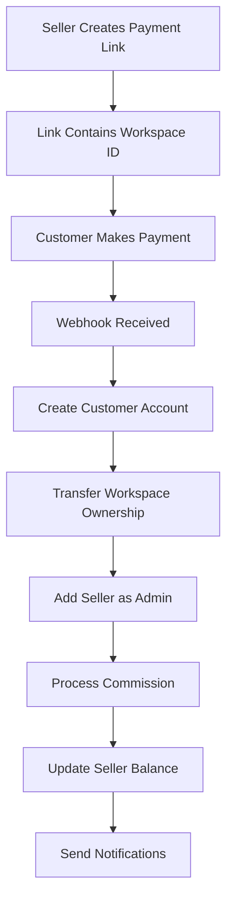

# Affiliate Workspace Marketplace Implementation Guide

## Table of Contents

1. [Overview](#overview)
2. [System Architecture](#system-architecture)
3. [Database Schema Updates](#database-schema-updates)
4. [Implementation Phases](#implementation-phases)
5. [Function Specifications](#function-specifications)
6. [Webhook Handling](#webhook-handling)
7. [Testing Strategy](#testing-strategy)
8. [Progress Tracking](#progress-tracking)

---

## Overview

### Business Requirements

The affiliate marketplace allows users to sell their workspaces to customers through payment links. When a customer purchases:

1. They receive ownership of the workspace
2. The seller becomes an admin member
3. The seller earns commission based on their percentage
4. Page visits are reset and protections removed
5. Domains are deleted from the workspace

### Technical Scope

- **NO** funnel selling (workspace-based only)
- **NO** workspace cloning (direct transfer)
- **NO** withdrawal system (Phase 1)
- **Focus**: Affiliate, Payment Links, Payments, Subscriptions

### Key Workflow



---

## System Architecture

### Current State

- Affiliate links track referrals for plan purchases
- Payments store commission amounts but don't process them
- Workspaces have single ownership model
- No workspace transfer mechanism exists

### Target State

- Affiliate links will include workspace selling capability
- Commission automatically credited to seller balance
- Workspace ownership transferable with role preservation
- Complete audit trail of all transactions

### Data Flow

```text
Payment Link Generation:
User -> API -> Validate Workspace -> Generate JWT -> Return Link

Payment Processing:
Customer -> MamoPay -> Webhook -> Our API -> Process Transfer -> Update Balance

Commission Flow:
Payment Created -> Calculate Commission -> Update Balance -> Log Transaction
```

---

## Database Schema Updates

### Phase 1: Core Schema Changes

#### 1. Update PaymentType Enum

```prisma
enum PaymentType {
  PLAN_PURCHASE
  ADDON_PURCHASE
  ADDON_RENEWAL
  WORKSPACE_PURCHASE  // NEW
}
```

#### 2. Update Payment Model

```prisma
model Payment {
  // ... existing fields ...
  workspaceId           Int?           // NEW: Workspace being purchased
  workspace             Workspace?     @relation(fields: [workspaceId], references: [id])
}
```

#### 3. Add BalanceTransaction Model

```prisma
model BalanceTransaction {
  id              Int                    @id @default(autoincrement())
  userId          Int
  type            BalanceTransactionType
  amount          Float
  balanceBefore   Float
  balanceAfter    Float
  referenceType   String?                // "Payment", "Withdrawal", etc.
  referenceId     Int?                   // ID of related record
  notes           String?
  createdAt       DateTime               @default(now())

  user            User                   @relation(fields: [userId], references: [id])

  @@index([userId])
  @@index([referenceType, referenceId])
}

enum BalanceTransactionType {
  COMMISSION      // Affiliate commission earned
  WITHDRAWAL      // Balance withdrawn
  ADJUSTMENT      // Manual adjustment by admin
  REFUND          // Commission refunded
}
```

#### 4. Add WorkspaceTransfer Model

```prisma
model WorkspaceTransfer {
  id              Int      @id @default(autoincrement())
  workspaceId     Int
  fromUserId      Int
  toUserId        Int
  paymentId       Int      @unique
  transferredAt   DateTime @default(now())

  // Relations
  workspace       Workspace @relation(fields: [workspaceId], references: [id])
  fromUser        User      @relation("TransfersFrom", fields: [fromUserId], references: [id])
  toUser          User      @relation("TransfersTo", fields: [toUserId], references: [id])
  payment         Payment   @relation(fields: [paymentId], references: [id])

  @@index([workspaceId])
  @@index([fromUserId])
  @@index([toUserId])
}
```

#### 5. Update User Model Relations

```prisma
model User {
  // ... existing fields ...
  balanceTransactions   BalanceTransaction[]
  workspaceTransfersFrom WorkspaceTransfer[] @relation("TransfersFrom")
  workspaceTransfersTo   WorkspaceTransfer[] @relation("TransfersTo")
}
```

#### 6. Update Workspace Model

```prisma
model Workspace {
  // ... existing fields ...
  payments              Payment[]
  transfers             WorkspaceTransfer[]
}
```

### Migration Command

```bash
npx prisma migrate dev --name add-affiliate-workspace-marketplace
```

---

## Implementation Phases

### Phase 1: Database and Models (Day 1-2)

- [ ] Update Prisma schema
- [ ] Run migrations
- [ ] Generate TypeScript types
- [ ] Create Zod schemas for validation

### Phase 2: Balance Management (Day 3-4)

- [ ] Implement BalanceTransaction service
- [ ] Create commission processing logic
- [ ] Add balance update functions
- [ ] Build transaction logging

### Phase 3: Workspace Transfer (Day 5-6)

- [ ] Create transfer ownership service
- [ ] Implement page visit reset
- [ ] Add password protection removal
- [ ] Integrate domain deletion

### Phase 4: Payment Link Updates (Day 7-8)

- [ ] Modify payment link creation
- [ ] Add workspace validation
- [ ] Update commission calculation
- [ ] Store workspace in custom_data

### Phase 5: Webhook Processing (Day 9-10)

- [ ] Update subscription webhook
- [ ] Add workspace transfer logic
- [ ] Process commissions
- [ ] Send notifications

### Phase 6: Testing & Integration (Day 11-12)

- [ ] Unit tests for all services
- [ ] Integration tests
- [ ] End-to-end testing
- [ ] Bug fixes and refinements

---

## Function Specifications

### 1. Balance Transaction Service

#### File: `/src/services/balance/create-transaction/index.ts`

```typescript
interface CreateBalanceTransactionParams {
  userId: number;
  type: BalanceTransactionType;
  amount: number;
  referenceType?: string;
  referenceId?: number;
  notes?: string;
}

async function createBalanceTransaction(
  params: CreateBalanceTransactionParams
): Promise<BalanceTransaction> {
  // 1. Get current balance
  // 2. Calculate new balance
  // 3. Create transaction record
  // 4. Update user balance
  // 5. Return transaction
}
```

#### Tests: `/src/services/balance/create-transaction/index.test.ts`

```typescript
describe("createBalanceTransaction", () => {
  it("should create a commission transaction");
  it("should update user balance correctly");
  it("should handle concurrent transactions");
  it("should reject negative balances for withdrawals");
  it("should log all transaction details");
});
```

---

### 2. Process Commissions Service

#### File: `/src/services/affiliate/process-commissions/index.ts`

```typescript
interface ProcessCommissionsResult {
  processed: number;
  totalAmount: number;
  transactions: BalanceTransaction[];
}

async function processUnpaidCommissions(): Promise<ProcessCommissionsResult> {
  // 1. Find all payments where affiliatePaid = false
  // 2. Group by affiliate user
  // 3. For each affiliate:
  //    a. Calculate total commission
  //    b. Create balance transaction
  //    c. Update user balance
  //    d. Mark payments as paid
  // 4. Return summary
}
```

#### Tests: `/src/services/affiliate/process-commissions/index.test.ts`

```typescript
describe("processUnpaidCommissions", () => {
  it("should find all unpaid commissions");
  it("should calculate commission correctly");
  it("should create balance transactions");
  it("should mark payments as paid");
  it("should handle commission for multiple users");
  it("should be idempotent (safe to run multiple times)");
});
```

---

### 3. Workspace Transfer Service

#### File: `/src/services/workspace/transfer-ownership/index.ts`

```typescript
interface TransferWorkspaceParams {
  workspaceId: number;
  fromUserId: number;
  toUserId: number;
  paymentId: number;
}

async function transferWorkspaceOwnership(
  params: TransferWorkspaceParams
): Promise<WorkspaceTransfer> {
  // 1. Validate workspace exists and is owned by fromUser
  // 2. Begin transaction
  // 3. Update workspace owner to toUser
  // 4. Add fromUser as ADMIN member
  // 5. Reset all page visits to 0
  // 6. Remove password protection from funnels
  // 7. Delete all domains (using existing service)
  // 8. Create transfer record
  // 9. Commit transaction
  // 10. Return transfer record
}
```

#### Sub-functions:

##### Reset Page Visits

```typescript
async function resetPageVisits(workspaceId: number): Promise<void> {
  // Update all pages in all funnels of workspace
  // Set visitCount = 0
}
```

##### Remove Password Protection

```typescript
async function removePasswordProtection(workspaceId: number): Promise<void> {
  // Find all funnel settings for workspace funnels
  // Set isPasswordProtected = false
  // Clear password field
}
```

##### Delete Workspace Domains

```typescript
async function deleteWorkspaceDomains(workspaceId: number): Promise<void> {
  // Get all domains for workspace
  // Call existing delete domain service for each
}
```

#### Tests: `/src/services/workspace/transfer-ownership/index.test.ts`

```typescript
describe("transferWorkspaceOwnership", () => {
  it("should transfer ownership to new user");
  it("should keep seller as admin member");
  it("should reset all page visits to 0");
  it("should remove password protection from all funnels");
  it("should delete all domains");
  it("should create transfer record");
  it("should rollback on error");
  it("should prevent duplicate transfers");
});
```

---

### 4. Generate Affiliate Link Service

#### File: `/src/services/affiliate/generate-affiliate-link/index.ts` (NEW)

```typescript
interface GenerateAffiliateLinkRequest {
  name: string;
  workspaceId: number;
  planType?: UserPlan; // Optional: defaults to BUSINESS if not provided
  settings?: Record<string, any>;
}

async function generateAffiliateLink(
  userId: number,
  data: GenerateAffiliateLinkRequest
): Promise<GenerateAffiliateLinkResponse> {
  // 1. Validate user exists
  const user = await prisma.user.findUnique({
    where: { id: userId },
    select: { id: true, commissionPercentage: true },
  });

  // 2. Validate workspace exists and user owns it
  const workspace = await prisma.workspace.findFirst({
    where: { id: data.workspaceId, ownerId: userId },
  });

  // 3. Check for duplicate link name
  const existingLink = await prisma.affiliateLink.findFirst({
    where: { userId, name: data.name },
  });

  // 4. Determine planType: Use provided planType or default to BUSINESS
  const planType = data.planType || UserPlan.BUSINESS;

  // 5. Create affiliate link
  const affiliateLink = await prisma.affiliateLink.create({
    data: {
      name: data.name,
      token: "", // Will be updated after JWT creation
      itemType: planType, // Use the determined planType
      userId,
      workspaceId: data.workspaceId,
      settings: data.settings || {},
    },
  });

  // 6. Generate JWT token with planType
  const tokenPayload = {
    userId,
    workspaceId: data.workspaceId,
    name: data.name,
    planType: planType, // Include planType in JWT
    commissionPercentage: user.commissionPercentage,
    settings: data.settings || {},
    affiliateLinkId: affiliateLink.id,
  };

  const token = jwt.sign(tokenPayload, process.env.JWT_SECRET!);

  // 7. Update affiliate link with token
  await prisma.affiliateLink.update({
    where: { id: affiliateLink.id },
    data: { token },
  });

  // 8. Return response
  return {
    message: "Affiliate link created successfully",
    id: affiliateLink.id,
    url: `${process.env.FRONTEND_URL}/affiliate?affiliate=${token}`,
    token,
  };
}
```

#### Key Points:

- **planType** is now in the request body (optional)
- **Default value**: If planType is not provided, it defaults to `BUSINESS`
- **Can be overridden**: User can specify `FREE`, `BUSINESS`, or `AGENCY`
- **Stored in affiliate link**: The `itemType` field stores the planType
- **Included in JWT**: The token contains the planType for later use
- **NOT from workspace**: We don't use `workspace.planType` anymore

#### Custom Data Structure for Workspace Purchase:

```typescript
custom_data: {
  details: {
    // ... existing user details ...
    paymentType: "WORKSPACE_PURCHASE",
    planType: "BUSINESS", // From affiliate link token
  },
  workspace: {
    id: number,
    name: string,
    slug: string,
    sellerId: number,
  },
  affiliateLink: {
    id: number,
    token: string,
    userId: number,
    planType: "BUSINESS", // From affiliate link
    commissionPercentage: 20,
  }
}
```

#### Tests: `/src/services/payment/create-payment-link/index.test.ts` (UPDATE)

```typescript
describe("createPaymentLink - Workspace Purchase", () => {
  it("should create payment link for workspace purchase");
  it("should validate workspace ownership");
  it("should include workspace data in custom_data");
  it("should calculate commission correctly");
  it("should reject if workspace not found");
  it("should reject if user does not own workspace");
});
```

---

### 5. Updated Subscription Webhook Handler

#### File: `/src/services/subscription/create/index.ts` (UPDATE)

```typescript
async function createSubscriptionFromWebhook(webhookData: any): Promise<void> {
  // ... existing validation ...

  const { details, workspace, affiliateLink } = webhookData.custom_data;

  if (details.paymentType === "WORKSPACE_PURCHASE" && workspace) {
    // NEW FLOW: Workspace Purchase

    // 1. Create user account (BUSINESS plan)
    const user = await createUser({
      ...details,
      plan: "BUSINESS", // Always BUSINESS for workspace buyers
    });

    // 2. Transfer workspace ownership
    await transferWorkspaceOwnership({
      workspaceId: workspace.id,
      fromUserId: workspace.sellerId,
      toUserId: user.id,
      paymentId: payment.id,
    });

    // 3. Process affiliate commission
    if (affiliateLink) {
      await processAffiliateCommission({
        paymentId: payment.id,
        affiliateUserId: affiliateLink.userId,
        amount: affiliateLink.affiliateAmount,
      });
    }

    // 4. Send notifications
    await sendWorkspacePurchaseEmails({
      buyer: user,
      seller: workspace.sellerId,
      workspace: workspace,
    });
  } else {
    // EXISTING FLOW: Plan Purchase
    // ... existing logic ...
  }
}
```

#### Tests: `/src/services/subscription/create/index.test.ts` (UPDATE)

```typescript
describe("createSubscriptionFromWebhook - Workspace Purchase", () => {
  it("should create BUSINESS account for buyer");
  it("should transfer workspace ownership");
  it("should process affiliate commission");
  it("should send notification emails");
  it("should handle webhook retry (idempotency)");
  it("should rollback on failure");
});
```

---

### 6. Affiliate Dashboard Services

#### Get Affiliate Balance

```typescript
// File: /src/services/affiliate/get-balance/index.ts
async function getAffiliateBalance(userId: number): Promise<{
  balance: number;
  pendingCommissions: number;
  totalEarned: number;
  totalSales: number;
}> {
  // 1. Get current balance from user
  // 2. Calculate pending commissions (unpaid payments)
  // 3. Sum total earned from balance transactions
  // 4. Count total sales
}
```

#### Get Sales History

```typescript
// File: /src/services/affiliate/get-sales-history/index.ts
async function getAffiliateSalesHistory(userId: number): Promise<{
  sales: Array<{
    workspace: Workspace;
    buyer: User;
    amount: number;
    commission: number;
    paidAt: Date;
  }>;
}> {
  // Get all workspace transfers where fromUserId = userId
  // Include payment and buyer details
}
```

---

## Webhook Handling

### MamoPay Webhook Structure

#### Payment Link Created

```json
{
  "event_type": "payment_link.create",
  "id": "MB-LINK-FA6D6D479B",
  "amount": 115.0,
  "amount_currency": "USD",
  "custom_data": {
    "details": {
      "email": "buyer@example.com",
      "firstName": "John",
      "lastName": "Doe",
      "planType": "BUSINESS",
      "paymentType": "WORKSPACE_PURCHASE"
    },
    "workspace": {
      "id": 123,
      "name": "Premium Templates",
      "slug": "premium-templates",
      "sellerId": 456
    },
    "affiliateLink": {
      "id": 1,
      "token": "jwt_token_here",
      "userId": 456,
      "affiliateAmount": 23.0
    }
  }
}
```

#### Successful Payment (charge.succeeded)

```json
{
  "event_type": "charge.succeeded",
  "id": "PAY-059835E3C8",
  "amount": 115.0,
  "amount_currency": "USD",
  "status": "captured",
  "custom_data": {
    "details": {
      "email": "buyer@example.com",
      "firstName": "John",
      "lastName": "Doe",
      "planType": "BUSINESS",
      "paymentType": "WORKSPACE_PURCHASE"
    },
    "workspace": {
      "id": 123,
      "name": "Premium Templates",
      "slug": "premium-templates",
      "sellerId": 456
    },
    "affiliateLink": {
      "id": 1,
      "token": "jwt_token_here",
      "userId": 456,
      "itemType": "BUSINESS",
      "affiliateAmount": 23.0
    }
  },
  "customer_details": {
    "name": "John Doe",
    "email": "buyer@example.com",
    "phone_number": "+1234567890"
  },
  "payment_method": {
    "type": "CREDIT VISA",
    "card_last4": "4242"
  }
}
```

### Webhook Processing Flow

```typescript
// 1. Validate webhook signature (if applicable)
// 2. Parse webhook data
// 3. Check for duplicate processing (idempotency)
// 4. Determine payment type from custom_data.details.paymentType
// 5. Route to appropriate handler:
//    - WORKSPACE_PURCHASE -> handleWorkspacePurchase()
//    - PLAN_PURCHASE -> handlePlanPurchase()
//    - ADDON_PURCHASE -> handleAddonPurchase()
// 6. Return success response
```

### Error Handling

- All webhook handlers must be idempotent
- Use database transactions for atomicity
- Log all errors with full context
- Return appropriate HTTP status codes
- Implement retry logic for transient failures

---

## Testing Strategy

### Test Levels

#### 1. Unit Tests

- Test individual functions in isolation
- Mock external dependencies
- Focus on business logic
- Aim for 90%+ coverage

#### 2. Integration Tests

- Test database interactions
- Test service compositions
- Use test database
- Test transaction rollbacks

#### 3. End-to-End Tests

- Test complete workflows
- Simulate webhook calls
- Verify all side effects
- Test error scenarios

### TDD Approach

For each function:

1. **Write test first** - Define expected behavior
2. **Run test** - Verify it fails
3. **Implement minimum code** - Make test pass
4. **Refactor** - Improve code quality
5. **Run all tests** - Ensure nothing broke

### Test File Structure

```
/src/services/
  /affiliate/
    /process-commissions/
      index.ts           # Implementation
      index.test.ts      # Tests
      fixtures.ts        # Test data
  /workspace/
    /transfer-ownership/
      index.ts           # Implementation
      index.test.ts      # Tests
      /utils/
        reset-visits.ts
        reset-visits.test.ts
```

### Critical Test Scenarios

#### Commission Processing

- [ ] Commission calculation accuracy
- [ ] Balance updates
- [ ] Transaction logging
- [ ] Concurrent processing
- [ ] Idempotency

#### Workspace Transfer

- [ ] Ownership change
- [ ] Member role preservation
- [ ] Page visit reset
- [ ] Password removal
- [ ] Domain deletion
- [ ] Rollback on error

#### Payment Flow

- [ ] Payment link generation
- [ ] Webhook processing
- [ ] User creation
- [ ] Email notifications
- [ ] Error handling

---

## Progress Tracking

### Phase 1: Database Setup ✅ COMPLETED

- [x] Update Prisma schema with new models
- [x] Add WORKSPACE_PURCHASE to PaymentType enum
- [x] Add workspaceId to AffiliateLink model (replaced funnelId)
- [x] Add workspaceId to Payment model
- [x] Create BalanceTransaction model
- [x] Create WorkspaceTransfer model
- [x] Database reset and push completed (production)
- [x] Test database schema synced
- [x] Generate TypeScript types
- [x] Update Zod schemas for GenerateAffiliateLinkRequest

### Phase 1.5: Generate Affiliate Link ✅ COMPLETED

- [x] Create GenerateAffiliateLinkRequest Zod schema
- [x] Create GenerateAffiliateLinkResponse Zod schema
- [x] Write 18 comprehensive integration tests for controller
- [x] Implement AffiliateLinkService.generateLink()
- [x] Implement AffiliateLinkController.generateLink()
- [x] Configure Vitest to use test database (.env.test)
- [x] Sync test database schema
- [x] All tests passing with real test database
- [x] Follow ARCHITECTURE.md patterns (Controller → Service → DB)
- [x] User-friendly error messages implemented
- [x] JWT token generation with all required fields
- [x] planType defaults to BUSINESS with override support

**Files Created/Updated:**

- ✅ `/src/types/affiliate/generate-affiliate-link/index.ts`
- ✅ `/src/services/affiliate/generate-affiliate-link/index.ts`
- ✅ `/src/controllers/affiliate/generate-affiliate-link/index.ts`
- ✅ `/src/test/affiliate/generate-affiliate-link.test.ts`
- ✅ `vitest.config.ts`
- ✅ `.env.test` (added FRONTEND_URL)

### Phase 2: Balance Management 📝 NEXT

- [ ] Create BalanceTransaction service
- [ ] Write tests for balance transactions
- [ ] Implement createBalanceTransaction
- [ ] Create processUnpaidCommissions service
- [ ] Write tests for commission processing
- [ ] Implement commission processing logic

### Phase 3: Workspace Transfer 🔄

- [ ] Create transfer service structure
- [ ] Write tests for workspace transfer
- [ ] Implement transferWorkspaceOwnership
- [ ] Create resetPageVisits utility
- [ ] Write tests for page visit reset
- [ ] Implement page visit reset
- [ ] Create removePasswordProtection utility
- [ ] Write tests for password removal
- [ ] Implement password removal
- [ ] Integrate domain deletion

### Phase 4: Payment Link Updates 💳

- [ ] Write tests for workspace payment links
- [ ] Update payment link creation service
- [ ] Add workspace validation
- [ ] Update commission calculation
- [ ] Test payment link generation

### Phase 5: Webhook Processing 🔔

- [ ] Write tests for workspace purchase webhook
- [ ] Update webhook handler for WORKSPACE_PURCHASE
- [ ] Implement user creation for buyers
- [ ] Integrate workspace transfer
- [ ] Process commissions
- [ ] Send notifications

### Phase 6: Dashboard APIs 📊

- [ ] Create getAffiliateBalance service
- [ ] Write tests for balance retrieval
- [ ] Create getSalesHistory service
- [ ] Write tests for sales history
- [ ] Update totalSales tracking

### Phase 7: Integration Testing ✅

- [ ] End-to-end payment flow test
- [ ] Webhook retry testing
- [ ] Error scenario testing
- [ ] Performance testing
- [ ] Security audit

### Phase 8: Documentation 📚

- [ ] API documentation
- [ ] Update README
- [ ] Create deployment guide
- [ ] Update environment variables

---

## Environment Variables

Add to `.env`:

```bash
# Existing variables...

# Affiliate System
AFFILIATE_COMMISSION_PERCENTAGE=20  # Default commission percentage
AFFILIATE_MIN_WITHDRAWAL=50         # Minimum withdrawal amount
PROCESS_COMMISSIONS_BATCH_SIZE=100  # Batch size for processing
```

---

## API Endpoints

### New Endpoints

```
POST   /api/affiliate/process-commissions  # Process unpaid commissions
GET    /api/affiliate/balance              # Get affiliate balance
GET    /api/affiliate/sales-history        # Get sales history
POST   /api/workspace/:id/transfer         # Manual workspace transfer (admin)
```

### Updated Endpoints

```
POST   /api/payment/create-payment-link    # Now accepts workspaceId
POST   /api/subscription/create            # Handles workspace purchases
```

---

## Deployment Checklist

### Pre-deployment

- [ ] All tests passing
- [ ] Database migrations ready
- [ ] Environment variables configured
- [ ] Monitoring setup
- [ ] Error tracking configured

### Deployment

- [ ] Deploy database migrations
- [ ] Deploy application code
- [ ] Verify webhook endpoints
- [ ] Test payment flow
- [ ] Monitor for errors

### Post-deployment

- [ ] Process any pending commissions
- [ ] Verify balance calculations
- [ ] Check email notifications
- [ ] Monitor performance
- [ ] Gather feedback

---

## Security Considerations

1. **Workspace Validation**: Always verify ownership before transfer
2. **Commission Calculation**: Use database transactions to prevent double-processing
3. **Webhook Security**: Validate webhook signatures if available
4. **Balance Updates**: Use atomic operations to prevent race conditions
5. **Audit Trail**: Log all financial transactions
6. **Access Control**: Restrict admin endpoints appropriately

---

## Future Enhancements (Phase 2)

1. **Withdrawal System**

   - Payout integration
   - Withdrawal requests
   - Minimum thresholds
   - Tax documentation

2. **Analytics Dashboard**

   - Conversion tracking
   - Revenue reports
   - Performance metrics
   - Affiliate leaderboard

3. **Workspace Marketplace**

   - Public listing page
   - Preview functionality
   - Reviews and ratings
   - Category filtering

4. **Advanced Commission Structure**
   - Tiered commissions
   - Performance bonuses
   - Recurring commissions
   - Multi-level affiliates

---

## Support and Troubleshooting

### Common Issues

#### Commission Not Credited

1. Check Payment.affiliatePaid status
2. Verify affiliateLinkId is set
3. Check for processing errors in logs
4. Run manual commission processing

#### Workspace Transfer Failed

1. Check WorkspaceTransfer records
2. Verify ownership before transfer
3. Check for constraint violations
4. Review transaction logs

#### Payment Link Invalid

1. Verify workspace exists
2. Check user ownership
3. Validate JWT token
4. Check expiration settings

### Debug Queries

```sql
-- Find unpaid commissions
SELECT * FROM Payment
WHERE affiliateLinkId IS NOT NULL
AND affiliatePaid = false;

-- Check balance transactions
SELECT * FROM BalanceTransaction
WHERE userId = ?
ORDER BY createdAt DESC;

-- Verify workspace transfers
SELECT * FROM WorkspaceTransfer
WHERE workspaceId = ?;
```

---

## Conclusion

This implementation guide provides a complete roadmap for building the affiliate workspace marketplace. Follow the phases sequentially, ensure comprehensive testing, and maintain clear documentation throughout the development process.

Remember:

- **Test First**: Write tests before implementation
- **Small Commits**: Make frequent, focused commits
- **Document Changes**: Update this guide as you progress
- **Validate Thoroughly**: Test all edge cases
- **Monitor Closely**: Watch for issues post-deployment

---

_Last Updated: [Current Date]_
_Version: 1.0.0_
