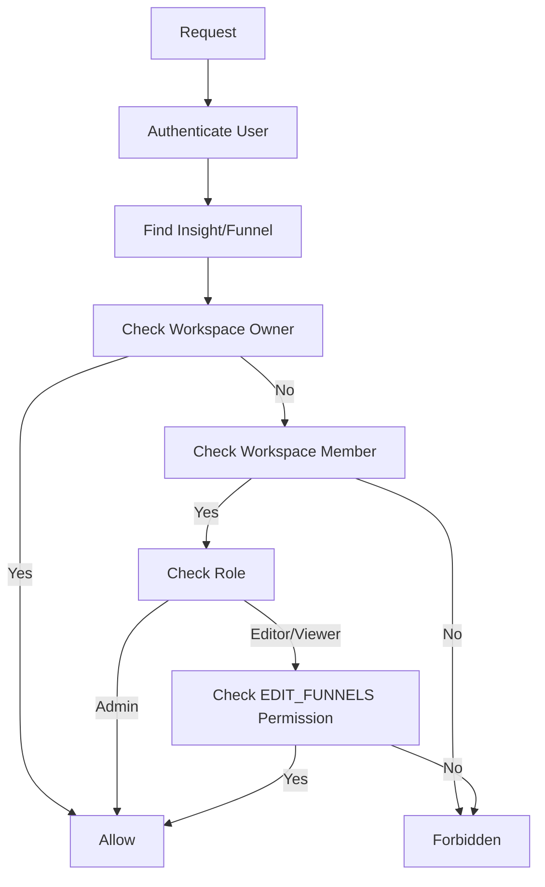

# Insight API Documentation

## Overview

Insight management system for the funnel builder platform. Handles the creation, updating, and deletion of insights that provide interactive data collection capabilities within funnels. Supports different insight types (QUIZ, SINGLE_CHOICE, MULTIPLE_CHOICE) with comprehensive workspace-based permissions and role management.

All routes require `authenticateToken` middleware for user authentication and workspace-based permissions.

---

## Insight Management Routes

### 1. Create Insight

**Route:** `POST /api/insights/`  
**Authentication:** Required

Creates a new insight with specified type and configuration for a funnel.

### Request Body

| Field         | Type     | Required | Description                    |
| ------------- | -------- | -------- | ------------------------------ |
| `type`        | enum     | Yes      | Insight type: QUIZ, SINGLE_CHOICE, or MULTIPLE_CHOICE |
| `name`        | string   | Yes      | Insight name (1-255 characters, trimmed) |
| `description` | string   | No       | Insight description (max 1000 characters, nullable) |
| `content`     | object   | No       | Insight content configuration (JSON object) |
| `settings`    | object   | No       | Insight display and behavior settings (JSON object) |
| `funnelId`    | number   | Yes      | Associated funnel ID (positive integer) |

### Response

```json
{
  "message": "Insight created successfully",
  "insightId": 123
}
```

### Validation Rules

- **Type**: Must be one of QUIZ, SINGLE_CHOICE, or MULTIPLE_CHOICE
- **Name**: Required, 1-255 characters, automatically trimmed
- **Description**: Optional, max 1000 characters, can be null
- **Content**: Optional JSON object, defaults to empty object
- **Settings**: Optional JSON object, defaults to empty object
- **Funnel Access**: User must have EDIT_FUNNELS permission for the target funnel

### Error Examples

```json
// Invalid type
{
  "error": "Type must be QUIZ, SINGLE_CHOICE, or MULTIPLE_CHOICE",
  "statusCode": 400
}

// Name too long
{
  "error": "Insight name must be less than 255 characters",
  "statusCode": 400
}

// Insufficient permissions
{
  "error": "You do not have permission to create insights for this funnel",
  "statusCode": 403
}

// Funnel not found
{
  "error": "Funnel not found",
  "statusCode": 404
}
```

---

### 2. Update Insight

**Route:** `PUT /api/insights/:id`  
**Authentication:** Required

Updates an existing insight's properties. Only accessible by users with proper workspace permissions.

### Path Parameters

| Parameter | Type   | Required | Description                    |
| --------- | ------ | -------- | ------------------------------ |
| `id`      | string | Yes      | Insight ID (positive integer)  |

### Request Body

All fields are optional for partial updates:

| Field         | Type     | Required | Description                    |
| ------------- | -------- | -------- | ------------------------------ |
| `type`        | enum     | No       | New insight type: QUIZ, SINGLE_CHOICE, or MULTIPLE_CHOICE |
| `name`        | string   | No       | New insight name (1-255 characters, trimmed) |
| `description` | string   | No       | New description (max 1000 characters, nullable) |
| `content`     | any      | No       | New content configuration |
| `settings`    | object   | No       | New settings (JSON object) |

### Response

```json
{
  "message": "Insight updated successfully",
  "insightId": 123
}
```

### Validation Rules

- **At least one field**: Must provide at least one field to update
- **Type validation**: If provided, must be valid InsightType enum
- **Name validation**: If provided, same rules as creation
- **Permission check**: User must have EDIT_FUNNELS permission for the insight's funnel

### Error Examples

```json
// No fields to update
{
  "error": "No fields provided to update",
  "statusCode": 400
}

// Insight not found
{
  "error": "Insight not found",
  "statusCode": 404
}

// Insufficient permissions
{
  "error": "You do not have permission to update insights in this funnel",
  "statusCode": 403
}

// Invalid ID format
{
  "error": "Insight ID must be a positive number",
  "statusCode": 400
}
```

---

### 3. Delete Insight

**Route:** `DELETE /api/insights/:id`  
**Authentication:** Required

Deletes an insight and all its associated submissions. Only accessible by users with proper workspace permissions.

### Path Parameters

| Parameter | Type   | Required | Description                    |
| --------- | ------ | -------- | ------------------------------ |
| `id`      | string | Yes      | Insight ID (positive integer)  |

### Response

```json
{
  "message": "Insight deleted successfully"
}
```

### Deletion Process

1. **Permission Check**: Verify user has EDIT_FUNNELS permission
2. **Existence Verification**: Confirm insight exists
3. **Cascade Delete**: Database automatically removes associated submissions
4. **Complete Removal**: Insight permanently deleted from system

### Error Examples

```json
// Insight not found
{
  "error": "Insight not found",
  "statusCode": 404
}

// Insufficient permissions
{
  "error": "You do not have permission to delete insights from this funnel",
  "statusCode": 403
}

// Invalid ID format
{
  "error": "Insight ID must be a valid number",
  "statusCode": 400
}
```

---

## Data Models

### Insight Types

```typescript
enum InsightType {
  QUIZ = 'QUIZ',
  SINGLE_CHOICE = 'SINGLE_CHOICE',
  MULTIPLE_CHOICE = 'MULTIPLE_CHOICE'
}
```

### Insight Object

```typescript
interface Insight {
  id: number;
  type: InsightType;
  name: string;
  description: string | null;
  content: Record<string, any>;
  settings: Record<string, any>;
  funnelId: number;
  createdAt: Date;
  updatedAt: Date;
  submissions: InsightSubmission[];
}
```

### Content Structure Examples

#### QUIZ Type
```json
{
  "questions": [
    {
      "id": "q1",
      "text": "What is your primary goal?",
      "type": "multiple_choice",
      "options": [
        {"id": "a", "text": "Increase sales"},
        {"id": "b", "text": "Generate leads"},
        {"id": "c", "text": "Build awareness"}
      ]
    }
  ]
}
```

#### SINGLE_CHOICE Type
```json
{
  "question": "Which option best describes you?",
  "options": [
    {"id": "beginner", "text": "Beginner"},
    {"id": "intermediate", "text": "Intermediate"},
    {"id": "advanced", "text": "Advanced"}
  ]
}
```

#### MULTIPLE_CHOICE Type
```json
{
  "question": "Select all that apply:",
  "options": [
    {"id": "email", "text": "Email Marketing"},
    {"id": "social", "text": "Social Media"},
    {"id": "paid", "text": "Paid Advertising"},
    {"id": "seo", "text": "SEO"}
  ],
  "maxSelections": 3
}
```

---

## Permission System

### Workspace Roles

- **Owner**: Full access to all insights in workspace funnels
- **Admin**: Full access to all insights in workspace funnels
- **Editor/Viewer**: Requires `EDIT_FUNNELS` permission for insight operations

### Permission Checks

All insight operations verify:
1. User authentication (JWT token)
2. Workspace membership (user belongs to funnel's workspace)
3. Role-based permissions (Owner/Admin automatic access)
4. Specific permissions (EDIT_FUNNELS required for Editor/Viewer roles)

### Permission Flow



---

## Technical Implementation

### Database Schema

```sql
-- Insights table
CREATE TABLE insight (
  id SERIAL PRIMARY KEY,
  type insight_type NOT NULL, -- ENUM: QUIZ, SINGLE_CHOICE, MULTIPLE_CHOICE
  name VARCHAR(255) NOT NULL,
  description TEXT,
  content JSONB DEFAULT '{}',
  settings JSONB DEFAULT '{}',
  funnel_id INTEGER NOT NULL REFERENCES funnel(id),
  created_at TIMESTAMP DEFAULT CURRENT_TIMESTAMP,
  updated_at TIMESTAMP DEFAULT CURRENT_TIMESTAMP
);

-- Insight submissions table (related)
CREATE TABLE insight_submission (
  id SERIAL PRIMARY KEY,
  insight_id INTEGER NOT NULL REFERENCES insight(id) ON DELETE CASCADE,
  submission_data JSONB NOT NULL,
  created_at TIMESTAMP DEFAULT CURRENT_TIMESTAMP
);
```

### Security Features

- **Authentication**: JWT token verification on all endpoints
- **Authorization**: Workspace-based permission system
- **Input Validation**: Zod schemas for all request/response data
- **SQL Injection**: Prisma ORM prevents SQL injection attacks
- **Role Enforcement**: Strict role-based access control
- **Permission Granularity**: Fine-grained permission system

### Error Handling

- **Validation Errors**: Detailed Zod validation messages
- **Permission Errors**: Specific forbidden access messages
- **Not Found Errors**: Clear entity identification
- **Server Errors**: Graceful error handling with logging

---

## Integration Examples

### JavaScript/TypeScript

```javascript
// Create insight
const createResponse = await fetch('/api/insights', {
  method: 'POST',
  headers: {
    'Content-Type': 'application/json',
    'Authorization': `Bearer ${token}`
  },
  body: JSON.stringify({
    type: 'QUIZ',
    name: 'Customer Preferences Quiz',
    description: 'Understand customer preferences and needs',
    funnelId: 456,
    content: {
      questions: [
        {
          id: 'q1',
          text: 'What is most important to you?',
          type: 'single_choice',
          options: [
            { id: 'price', text: 'Price' },
            { id: 'quality', text: 'Quality' },
            { id: 'service', text: 'Service' }
          ]
        }
      ]
    },
    settings: {
      showProgress: true,
      allowBack: true
    }
  })
});

// Update insight
const updateResponse = await fetch('/api/insights/123', {
  method: 'PUT',
  headers: {
    'Content-Type': 'application/json',
    'Authorization': `Bearer ${token}`
  },
  body: JSON.stringify({
    name: 'Updated Quiz Name',
    settings: {
      showProgress: false,
      allowBack: false
    }
  })
});

// Delete insight
const deleteResponse = await fetch('/api/insights/123', {
  method: 'DELETE',
  headers: {
    'Authorization': `Bearer ${token}`
  }
});
```

### cURL Examples

```bash
# Create insight
curl -X POST "https://api.example.com/api/insights" \
  -H "Content-Type: application/json" \
  -H "Authorization: Bearer your_token" \
  -d '{
    "type": "SINGLE_CHOICE",
    "name": "Product Interest Survey",
    "description": "Gauge interest in new products",
    "funnelId": 456,
    "content": {
      "question": "Which product interests you most?",
      "options": [
        {"id": "product_a", "text": "Product A"},
        {"id": "product_b", "text": "Product B"}
      ]
    }
  }'

# Update insight
curl -X PUT "https://api.example.com/api/insights/123" \
  -H "Content-Type: application/json" \
  -H "Authorization: Bearer your_token" \
  -d '{
    "name": "Updated Survey",
    "description": "Updated description"
  }'

# Delete insight
curl -X DELETE "https://api.example.com/api/insights/123" \
  -H "Authorization: Bearer your_token"
```

---

## Best Practices

### Content Design

- **Clear Questions**: Write concise, unambiguous questions
- **Logical Options**: Provide mutually exclusive and collectively exhaustive options
- **Progressive Disclosure**: Use quiz format for complex data collection
- **User Experience**: Consider flow and cognitive load

### Settings Configuration

- **Progress Indication**: Show progress for multi-step insights
- **Navigation Control**: Allow users to go back and review answers
- **Validation Rules**: Implement client-side and server-side validation
- **Responsive Design**: Ensure insights work on all device types

### Performance Considerations

- **Content Size**: Keep content objects reasonably sized
- **Database Indexing**: Ensure proper indexing on funnelId for queries
- **Caching**: Consider caching frequently accessed insight configurations
- **Bulk Operations**: Use transactions for multiple related operations